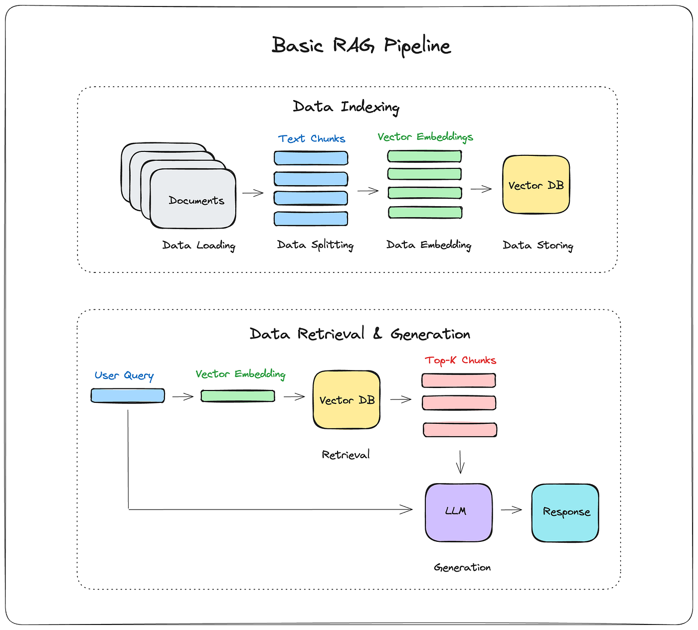

# 09. The GIST of RAG — Embeddings, Vector Databases & Retrieval

A comprehensive guide to Retrieval Augmented Generation: what it is, why it matters, and how every component fits together.

*Based on Section 9: The GIST of RAG (Chapters 42–50)*

---

## What is this section about?

This section teaches you how to build a **RAG pipeline** — the most common production pattern for making LLMs answer questions about your private data. We start with the "why" (motivation), then move through every building block (embeddings, vector stores, chunking, retrieval), and end with two complete implementations.

---

## Key Definitions (Interview-Ready)

Use these as your opening sentence when asked "What is X?" in an interview:

| Term | Quick Recall (say this first) | Full Definition |
|------|------|------------|
| **RAG** | "Retrieve context, augment the prompt, generate the answer" | A technique that retrieves relevant documents from a knowledge base, injects them into the LLM's prompt as context, and generates a grounded answer — solving the problem of LLMs not knowing your private data. |
| **Embedding** | "Text → vector of numbers" | A numerical representation (vector) of text where semantically similar texts are close together in vector space, enabling mathematical similarity comparisons. |
| **Vector Database** | "Database optimized for similarity search" | A specialized database that stores high-dimensional vectors and provides fast nearest-neighbor search — enabling retrieval of semantically similar documents at scale. |
| **Chunking** | "Split large docs into digestible pieces" | The process of breaking a large document into smaller segments (chunks) that fit within the LLM's context window while preserving semantic meaning. |
| **Similarity Search** | "Find the closest vectors" | A query operation that takes a vector and returns the k nearest vectors in the database, measured by distance metrics like cosine similarity. |
| **Retriever** | "Query → relevant documents" | A component that takes a user query, embeds it, and returns the top-k most relevant document chunks from the vector store. |
| **Context Window** | "Max tokens the LLM can process" | The hard limit on how many tokens (input + output) an LLM can handle in a single request — exceeded tokens are rejected. |
| **Document Loader** | "Any source → LangChain Document" | A LangChain abstraction that loads data from any source (PDF, text, Notion, Google Drive) into a standardized `Document` object with `page_content` and `metadata`. |
| **Text Splitter** | "Chunk with strategy" | A LangChain utility that splits documents into chunks using configurable strategies (character count, token count, recursive splitting) with optional overlap. |
| **LCEL** | "Pipe operator for LangChain" | LangChain Expression Language — a declarative syntax using the `|` operator to compose Runnables into chains with built-in streaming, async, and batch support. |
| **RunnablePassthrough** | "Pass input through unchanged" | A LangChain Runnable that forwards its input unchanged while optionally computing and assigning new keys to the output dictionary. |
| **Grounding** | "Answer backed by evidence" | The practice of ensuring an LLM's response is based on retrieved factual data (the context) rather than its parametric knowledge or hallucination. |

---

## The Problem RAG Solves

### Why can't we just ask the LLM directly?

LLMs are trained on public internet data up to a knowledge cutoff date. They have **no knowledge** of:
- Your company's internal documents
- Recent events after their training cutoff
- Private databases, PDFs, or codebases

### The Naive Solution (and why it fails)

> "Just stuff the entire document into the prompt."

This breaks for **four reasons**:

| Problem | Explanation |
|---------|-------------|
| **1. Token Limit** | LLMs have a hard cap (e.g., 4K, 128K, 1M tokens). Exceeding it = request rejected. |
| **2. Needle in a Haystack** | Research proves LLMs become less accurate with longer contexts — they "lose" information in the middle of long prompts. |
| **3. Cost** | More tokens = higher API costs. Sending 100K tokens when you need 500 is wasteful. |
| **4. Latency** | More tokens = slower processing time. Users wait longer for answers. |

### The RAG Solution

Instead of sending everything, we:
1. **Pre-process**: Split the document into small chunks and store them as vectors
2. **Retrieve**: Find only the chunks relevant to the user's question
3. **Augment**: Inject those chunks into the prompt as context
4. **Generate**: Let the LLM answer grounded in the relevant context

This solves all four problems: stays within token limits, focuses the LLM on relevant data, reduces cost, and improves latency.

---

## The RAG Pipeline (Two Phases)



### Phase 1: Ingestion (Offline, One-Time)

```
Document → Load → Chunk → Embed → Store in Vector DB
```

| Step | What Happens | LangChain Component |
|------|-------------|-------------------|
| **Load** | Read the file into a LangChain `Document` | `TextLoader`, `PyPDFLoader`, etc. |
| **Chunk** | Split into smaller pieces (e.g., 1000 chars) | `CharacterTextSplitter` |
| **Embed** | Convert each chunk into a vector | `OpenAIEmbeddings` |
| **Store** | Save vectors + metadata in vector DB | `PineconeVectorStore.from_documents()` |

### Phase 2: Retrieval + Generation (Online, Per-Query)

```
User Query → Embed → Similarity Search → Top-K Chunks → Augment Prompt → LLM → Answer
```

| Step | What Happens | LangChain Component |
|------|-------------|-------------------|
| **Embed Query** | Convert user question into a vector | `OpenAIEmbeddings` |
| **Search** | Find k nearest chunk vectors | `retriever.invoke(query)` |
| **Format** | Join chunks into a context string | `format_docs()` |
| **Augment** | Plug context + question into prompt template | `ChatPromptTemplate` |
| **Generate** | Send augmented prompt to LLM | `ChatOpenAI` |

---

## Deep Dive: Embeddings

### What is an Embedding?

An embedding model is a **black box** that:
- **Input**: Text (word, sentence, paragraph)
- **Output**: A vector (list of numbers, e.g., 1536 dimensions)

The key property: **semantically similar texts produce vectors that are close together** in vector space.

### Example

```
"I want to order an extra large coffee"  →  [0.23, -0.45, 0.89, ...]
"I'll have a tall coffee"                →  [0.21, -0.43, 0.91, ...]  ← CLOSE!
"The stock market crashed today"         →  [0.78,  0.12, -0.56, ...] ← FAR!
```

Even cross-language: "quiero pedir café extra grande" would be close to the coffee vectors.

### Distance Metrics

| Metric | Use Case | How It Works |
|--------|----------|--------------|
| **Cosine Similarity** | Most common, default in Pinecone | Measures angle between vectors (0° = identical) |
| **Euclidean Distance** | When magnitude matters | Straight-line distance in vector space |
| **Dot Product** | Fast computation | Combination of angle and magnitude |

### Embedding Models

| Model | Provider | Dimensions | Notes |
|-------|----------|-----------|-------|
| `text-embedding-3-small` | OpenAI | 512–1536 | Good balance of cost/quality |
| `text-embedding-ada-002` | OpenAI | 1536 | Legacy but still widely used |
| `text-embedding-3-large` | OpenAI | 256–3072 | Highest quality, most expensive |

**Rule of thumb**: Longer vectors = more semantic information captured, but higher storage/compute cost.

---

## Deep Dive: Vector Databases

### What is a Vector Database?

A specialized database that:
1. **Stores** high-dimensional vectors alongside metadata
2. **Indexes** vectors for fast nearest-neighbor search
3. **Retrieves** the top-k most similar vectors to a query vector

### Why not just use a regular database?

Regular databases search by exact match (`WHERE name = 'laptop'`). Vector databases search by **semantic similarity** — "find me documents that mean something similar to this question."

### Pinecone (Used in This Course)

- **Managed**: Cloud-based, no infrastructure to manage
- **Serverless**: Pay per query, scales automatically
- **Free tier**: Sufficient for learning and prototyping

#### Pinecone Index Configuration

| Setting | Our Value | Why |
|---------|-----------|-----|
| **Dimensions** | 1536 | Must match embedding model output size |
| **Metric** | Cosine | Default, works well for text similarity |
| **Type** | Dense | Standard for text embeddings |
| **Mode** | Serverless | Cost-effective for development |

#### Data Structure in Pinecone

Each record contains:
```json
{
  "id": "unique-vector-id",
  "values": [0.23, -0.45, 0.89, ...],  // The embedding vector (1536 numbers)
  "metadata": {
	"text": "The actual chunk content...",
	"source": "mediumblog1.txt"           // Where this chunk came from
  }
}
```

### Other Vector Databases

| Database | Type | Notes |
|----------|------|-------|
| **Pinecone** | Managed (Cloud) | Used in this course. Serverless, easy setup. |
| **Chroma** | Open Source (Local) | Great for prototyping, runs in-process |
| **Weaviate** | Open Source / Cloud | GraphQL interface, hybrid search |
| **Qdrant** | Open Source / Cloud | Rust-based, high performance |
| **Milvus** | Open Source | Designed for billion-scale vectors |

---

## Deep Dive: Chunking

### Why Chunk?

Even with 1M token context windows, chunking is critical because of **garbage in, garbage out**: sending irrelevant context degrades LLM answers, wastes tokens, and adds cost.

### Chunking Parameters

| Parameter | What It Controls | Our Value |
|-----------|-----------------|-----------|
| `chunk_size` | Maximum characters per chunk | 1000 |
| `chunk_overlap` | Characters shared between adjacent chunks | 0 |
| `separator` | Character(s) to split on | `\n\n` (double newline) |

### The Chunk Size Trade-Off

| Too Small | Too Large |
|-----------|-----------|
| Chunks lose context/meaning | Includes irrelevant information |
| Need more chunks to cover a topic | Wastes tokens and increases cost |
| More retrieval calls | Worse "needle in haystack" effect |

**Rule of thumb**: A chunk should make sense if you read it as a human. If it's gibberish in isolation, it's too small.

### Chunk Overlap

When `chunk_overlap > 0`, adjacent chunks share some text. This helps when an answer spans a chunk boundary — the overlapping text ensures both chunks contain the complete context.

```
Chunk 1: [A B C D E F G H]
Chunk 2:         [G H I J K L M N]   ← G,H appear in both (overlap = 2)
```

### Advanced Chunking Strategies (Production)

| Strategy | When to Use |
|----------|-------------|
| **Character-based** | Simple text documents |
| **Token-based** | When you need precise token counts |
| **Recursive** | Structured documents (tries headers, then paragraphs, then sentences) |
| **Semantic** | When meaning boundaries don't align with formatting |
| **Code-aware** | Source code (respects function/class boundaries) |

---

## Deep Dive: The Retriever

### What is `as_retriever()`?

Calling `vectorstore.as_retriever()` returns a **VectorStoreRetriever** object — a LangChain Runnable that wraps the vector store's search functionality.

```python
retriever = vectorstore.as_retriever(search_kwargs={"k": 3})
```

- `k=3` means: return the top 3 most relevant chunks
- The retriever has an `invoke()` method (it's a Runnable)
- Under the hood, it calls the vendor's similarity search implementation

### How Retrieval Works (Step by Step)

1. User asks: *"What is Pinecone in machine learning?"*
2. The query string is embedded into a vector using the same embedding model
3. The vector is sent to Pinecone for similarity search
4. Pinecone returns the top-k vectors (with their metadata/text)
5. LangChain wraps them as `Document` objects with `page_content` and `metadata`

### Why k=3?

- More chunks = more context = better coverage **but** also more noise
- Fewer chunks = more focused **but** might miss relevant info
- `k=3` is a practical starting point; tune based on your data and prompt size

---

## Production Considerations

### Why Not Use an Agent for RAG?

LangChain's documentation shows an "Agentic RAG" approach where retrieval is wrapped as a tool and a ReAct agent decides when to call it. **Eden explicitly advises against this for production:**

| Agentic RAG (Not Recommended) | Deterministic RAG (Recommended) |
|------|------|
| LLM *decides* whether to search | Always searches the knowledge base |
| Can skip searches when needed | Predictable behavior every time |
| Can answer off-topic questions | Stays within business logic bounds |
| 2 LLM calls per query (reason + answer) | 1 LLM call per query |
| Higher latency and cost | Lower latency and cost |
| Vulnerable to jailbreaking | Controlled pipeline |

**When IS Agentic RAG appropriate?** When you genuinely need the agent to decide between multiple tools (web search, calculator, database, etc.) — not when retrieval should always happen.

### The Better Architecture (Coming Later)

The course later covers **Agentic RAG with LangGraph** — based on research papers with:
- Hallucination checking
- Answer relevance validation
- Deterministic graph-based control flow
- Much more robust than a simple ReAct agent

### LangSmith Tracing

Without LCEL, each step (retrieval, formatting, LLM call) appears as separate traces — hard to debug.

With LCEL, the entire pipeline appears as **one unified trace** showing:
- Input question
- Each step's duration
- The bottleneck (usually the LLM call)
- Final output

This is critical for production debugging and optimization.

---

## Interview Q&A Anchors

**Q: What is RAG and why do we need it?**

> **A:** RAG stands for Retrieval Augmented Generation. It solves the problem of LLMs not knowing about private or recent data. Instead of stuffing the entire document into the prompt (which hits token limits, costs more, adds latency, and reduces accuracy), RAG retrieves only the relevant chunks, augments the prompt with them, and generates a grounded answer. The three letters map directly to the pipeline: **R**etrieve relevant chunks → **A**ugment the prompt with context → **G**enerate the answer.

**Q: What are the four problems with stuffing the entire document into the prompt?**

> **A:** (1) **Token limit** — exceeding the context window causes request failure. (2) **Needle in a haystack** — longer prompts reduce LLM accuracy (proven by research). (3) **Cost** — more tokens = higher API bills. (4) **Latency** — more tokens = slower response times.

**Q: What is an embedding and why is it useful for RAG?**

> **A:** An embedding is a vector (list of numbers) that represents text in a high-dimensional space where semantically similar texts are close together. This enables us to convert a user's question into a vector, then use mathematical distance calculations to find the stored chunks whose vectors are closest — meaning they're semantically most relevant to the question.

**Q: What is a vector database and how is it different from a regular database?**

> **A:** A vector database stores high-dimensional vectors and provides fast nearest-neighbor similarity search. Unlike regular databases that do exact-match queries (`WHERE id = 5`), vector databases find items that are *semantically similar* to a query vector — essential for finding relevant document chunks in RAG.

**Q: Why do we split documents into chunks even with 1M token context windows?**

> **A:** Because of "garbage in, garbage out." Even if the context window is large enough, sending irrelevant text (1) costs more tokens, (2) proven by research to degrade answer quality (needle in haystack problem), and (3) increases latency. Chunking lets us send only the relevant portions.

**Q: What is the difference between the naive RAG implementation and the LCEL version?**

> **A:** Both produce the same answer. The naive version calls each step manually (retrieve → format → prompt → LLM) as separate function calls. The LCEL version composes them into a single chain using the `|` operator, which gives you: built-in streaming (`.stream()`), async support (`.ainvoke()`), batch processing (`.batch()`), better composability with other chains, and unified LangSmith tracing where all steps appear under one trace.

**Q: What does `RunnablePassthrough.assign()` do?**

> **A:** It passes the input dictionary through unchanged while computing and adding new keys. In our RAG chain, the input is `{"question": "..."}`. `RunnablePassthrough.assign(context=...)` keeps the `question` key and adds a `context` key computed by the retrieval sub-chain. The output `{"question": "...", "context": "..."}` then feeds into the prompt template.

**Q: Why does Eden recommend deterministic RAG over agentic RAG for production?**

> **A:** In production (e.g., customer support), you always want to query the knowledge base — there's no decision to make. Wrapping retrieval as a tool inside a ReAct agent adds: an extra LLM call (to decide whether to search), latency, cost, and vulnerability to jailbreaking. It also means the agent might skip the search or answer off-topic questions. Deterministic RAG guarantees predictable behavior, lower cost, and stays within business logic.

---

## References

- [LangChain RAG Tutorial](https://docs.langchain.com/)
- [LangChain Python Build Overview](https://docs.langchain.com/oss/python/build-overview)
- [LangChain API Reference](https://reference.langchain.com/python/langchain)
- [What is RAG? (Medium)](https://medium.com/@drjulija/what-is-retrieval-augmented-generation-rag-938e4f6e03d1)
- [Needle in a Haystack Research](https://arxiv.org/abs/2307.03172)
- [Pinecone Documentation](https://docs.pinecone.io/)
