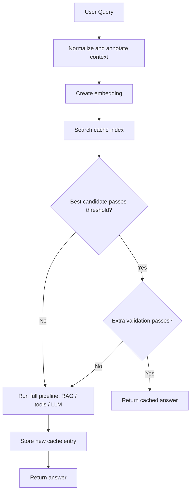

# 36. Semantic Caching for AI Agents

> **Context:** Section 25. This is a production-grade, one-stop concept note on semantic caching for LLM applications and AI agents. It is written from first principles and focuses on how an engineer should design, evaluate, and operate a semantic cache safely. The goal is not just to understand the idea, but to know when it helps, when it is dangerous, and how to make it trustworthy in production.

> 💡 **Thesis.** Semantic caching is one of the highest-leverage optimizations for LLM systems with repeated user intent. It can reduce latency and inference spend dramatically, but only if you treat it as a retrieval-and-decision system with its own evaluation, freshness, security, and observability requirements.

---

## Table of Contents

| # | Section | What You'll Learn |
|---|---------|-------------------|
| 1 | [Why Semantic Caching Exists](#1-why-semantic-caching-exists) | Why LLM systems need a meaning-based cache, not just a string-based cache |
| 2 | [Semantic Caching in the LLM Optimization Stack](#2-semantic-caching-in-the-llm-optimization-stack) | How it differs from prompt caching, exact-match caching, and RAG |
| 3 | [Deep Dive: Core Mental Model](#3-deep-dive-core-mental-model) | The end-to-end hit/miss decision process |
| 4 | [Deep Dive: Embeddings, Similarity, and Distance](#4-deep-dive-embeddings-similarity-and-distance) | Why vector similarity makes paraphrase reuse possible |
| 5 | [Deep Dive: Cache Entry Design](#5-deep-dive-cache-entry-design) | What metadata and boundaries a production cache entry needs |
| 6 | [Deep Dive: Agent Architecture Patterns](#6-deep-dive-agent-architecture-patterns) | Where semantic caching fits in agent and RAG systems |
| 7 | [Deep Dive: Evaluation and Metrics](#7-deep-dive-evaluation-and-metrics) | Precision, recall, hit rate, latency, and business impact |
| 8 | [Deep Dive: Threshold Tuning](#8-deep-dive-threshold-tuning) | How to choose thresholds without corrupting quality |
| 9 | [Deep Dive: Accuracy Improvement Techniques](#9-deep-dive-accuracy-improvement-techniques) | Re-ranking, fuzzy matching, LLM verification, and hybrid guards |
| 10 | [Deep Dive: Freshness, Invalidation, and Multi-Tenancy](#10-deep-dive-freshness-invalidation-and-multi-tenancy) | How to stop stale or cross-tenant answers from leaking |
| 11 | [Deep Dive: Observability and Operations](#11-deep-dive-observability-and-operations) | How to monitor, test, and run semantic cache in production |
| 12 | [Deep Dive: Risks, Failure Modes, and Anti-Patterns](#12-deep-dive-risks-failure-modes-and-anti-patterns) | The most common ways teams misuse semantic caching |
| 13 | [C# / .NET Analogies](#13-c--net-analogies) | Mappings to familiar software engineering patterns |
| 14 | [Interview Q&A Anchors](#interview-qa-anchors) | Concise, production-grade interview answers |
| 15 | [References](#references) | Official docs and further reading |

---

## Key Definitions

| Term | Quick Recall | Full Definition |
|------|--------------|-----------------|
| **Semantic Cache** | Cache by meaning, not exact text | A cache that retrieves prior answers by semantic similarity between queries, usually using embeddings and vector search rather than exact string equality. |
| **Embedding** | Numeric meaning representation | A vector representation of text where semantically similar phrases tend to appear close together in vector space. |
| **Vector Search** | Nearest-neighbor lookup in embedding space | A search method that finds the cached items whose embeddings are closest to a new query embedding using a similarity or distance metric. |
| **Similarity Threshold** | The cache decision boundary | A configured cut-off used to decide whether a retrieved candidate is similar enough to reuse safely. |
| **Cache Hit** | Reused prior answer | A request served from cache without invoking the expensive downstream generation path. |
| **False Positive Cache Hit** | Wrong reuse | A cache hit where the retrieved answer is not actually valid for the new query, even though the system judged it similar enough. |
| **Precision** | Correctness of hits | Of all cache hits, the percentage that were truly correct for the incoming query. |
| **Recall** | Coverage of reusable opportunities | Of all requests that could have been served correctly from cache, the percentage that actually were. |
| **F1 Score** | Balance between precision and recall | The harmonic mean of precision and recall, useful when you need both safety and usefulness. |
| **Re-ranker** | Second-stage quality check | A stronger model that re-scores the top vector-search candidates, often improving accuracy over embeddings alone. |
| **TTL** | Time-to-live freshness control | The expiry duration after which a cache entry is invalidated automatically. |
| **Multi-Tenant Partitioning** | Cache isolation boundary | Separating cache entries by user, tenant, workspace, domain, or policy scope so semantically similar requests do not leak private or irrelevant answers. |

---

## 1. Why Semantic Caching Exists

Traditional software systems use caching because repeated work is wasteful. LLM systems have the same problem, but in a harder form:

1. Users rarely repeat the exact same wording.
2. AI agents often make several LLM calls per user request.
3. Retrieval and generation are frequently the most expensive and latency-heavy parts of the system.

In many real workloads, repeated intent is common:

- customer support FAQs
- internal knowledge assistants
- e-commerce help flows
- policy and compliance explainers
- agent subtasks that recur across sessions

If every paraphrase goes through the full pipeline again, the system pays repeatedly for work it already knows how to do.

Semantic caching exists to exploit **intent repetition** instead of **string repetition**.

### Why this matters more for agents than for simple chatbots

A single-turn chatbot may only make one model call. An agent may:

1. decompose the task
2. retrieve documents
3. call tools
4. synthesize an answer
5. reflect or retry

That means repeated intents do not just duplicate one generation cost. They duplicate a whole decision pipeline.

---

## 2. Semantic Caching in the LLM Optimization Stack

Semantic caching is often confused with several other optimizations. They solve related but different problems.

| Technique | What it caches | Matching rule | Main value |
|-----------|----------------|---------------|------------|
| **Exact-match response cache** | Full request/response pairs | Exact string equality | Cheap and precise, but weak recall for natural language |
| **Provider prompt caching** | Reused prompt prefix/context at model-provider layer | Token-prefix reuse | Reduces prompt-processing cost, but still calls the model |
| **Retrieval cache** | Search or vector DB results | Exact or approximate query reuse | Reduces retrieval cost, not answer generation cost |
| **Tool-result cache** | Deterministic API/tool outputs | Usually exact parameter match | Saves external API cost and latency |
| **Semantic response cache** | Prior answers to semantically equivalent requests | Embedding similarity + quality guards | Avoids full downstream reasoning/generation |

### Important distinction: semantic cache is not the same as RAG

RAG finds relevant **source material** for a new question.

Semantic cache tries to reuse an existing **final answer** or intermediate result when the new question is meaningfully equivalent to a past one.

These complement each other:

- semantic cache avoids unnecessary RAG+LLM work
- RAG handles truly new or changed questions

### Important distinction: semantic cache is not the same as provider prompt caching

Provider prompt caching helps when the same long prompt prefix appears across requests. That is mainly a token-cost optimization. It does **not** mean the answer itself is reused, and it still depends on a model invocation.

Semantic caching is an application-level decision to bypass generation entirely when reuse is judged safe.

---

## 3. Deep Dive: Core Mental Model

At a high level, semantic caching is a **retrieve-then-decide** system.



### The decision is not binary similarity only

A naive implementation says:

- nearest embedding above threshold = hit
- otherwise = miss

That is usually too simplistic for production. In real systems, the cache decision often depends on:

- similarity score
- tenant boundary
- language or locale
- personalization requirements
- policy version
- document freshness
- risk level of the request

This is why semantic cache should be treated as a subsystem with explicit policy, not just a helper function.

### Minimal pseudo-code

```python
# Illustrative only
query_embedding = embed(query)

candidates = cache_index.search(
    vector=query_embedding,
    top_k=5,
    filters={
        "tenant_id": tenant_id,
        "locale": locale,
        "policy_version": policy_version,
    },
)

best = candidates[0] if candidates else None

if best and best.similarity >= THRESHOLD:
    if verify_cache_hit(query, best.query, best.answer, metadata=best.metadata):
        return best.answer, {"route": "semantic_cache_hit", "cache_id": best.id}

answer = run_agent_or_rag(query)
cache_index.upsert(query=query, answer=answer, metadata={...})
return answer, {"route": "semantic_cache_miss"}
```

---

## 4. Deep Dive: Embeddings, Similarity, and Distance

The backbone of semantic caching is the assumption that embeddings capture enough meaning for paraphrases to cluster together.

### Why embeddings help

These questions are lexically different but semantically close:

- "How do I get a refund?"
- "I want my money back."
- "What is the return policy for a purchase I no longer want?"

An exact-match cache sees three unrelated strings.

An embedding model maps them into vectors that should land near each other.

### Common similarity metrics

| Metric | Intuition | Notes |
|--------|-----------|-------|
| **Cosine similarity** | Compares angle between vectors | Common default for normalized embeddings |
| **Dot product** | Compares directional alignment and magnitude | Often used when embeddings are trained for it |
| **Euclidean distance** | Straight-line geometric distance | Less common in app-level explanations, but still valid |

### Why threshold choice is model-specific

There is no universal threshold such as "0.85 always means equivalent." Threshold meaning depends on:

- embedding model family
- normalization behavior
- domain vocabulary
- query length distribution
- how broad or narrow your notion of "same answer" is

This is why threshold selection must be empirical.

### A subtle but important point

Semantic similarity does **not** automatically mean answer equivalence.

Example:

- "Can I get a refund after 30 days?"
- "Can I get a refund after 60 days?"

These are semantically close, but may require different answers under business policy. That is exactly why a second validation layer is often needed.

---

## 5. Deep Dive: Cache Entry Design

The easiest way to break semantic caching is to treat the entry as only:

- query
- answer
- embedding

That is not enough for production.

### Recommended cache-entry fields

| Field | Why it matters |
|-------|----------------|
| `id` | Stable identifier for tracing and invalidation |
| `query_text` | Original query for debugging and verification |
| `query_embedding` | Vector used for similarity search |
| `answer` | Cached response or structured output |
| `answer_format` | Needed if some routes return JSON and others return prose |
| `tenant_id` | Prevent cross-tenant leakage |
| `user_segment` or `role` | Useful when answers differ by permissions or subscription level |
| `locale` / `language` | Avoid wrong-language reuse |
| `policy_version` | Prevent stale-policy answers from surviving rule changes |
| `knowledge_snapshot` | Helps invalidate entries when underlying source corpus changes |
| `created_at` / `last_hit_at` | Needed for TTL and cache-health analysis |
| `ttl_expires_at` | Automatic freshness boundary |
| `source_refs` | Helpful when debugging where answer came from |
| `risk_level` | Lets you apply stricter verification on high-stakes queries |

### What should the value be?

You have several options:

1. Cache only final user-facing answer.
2. Cache answer plus source citations.
3. Cache structured output used by downstream systems.
4. Cache intermediate agent subtasks.

The right choice depends on your application. If your downstream system needs strict JSON, cache the JSON, not only a rendered sentence.

### Beginner-safe rule

If the answer depends on changing business state, personalization, live data, or authorization, cache less aggressively and include more metadata filters.

---

## 6. Deep Dive: Agent Architecture Patterns

Semantic caching can sit at more than one level in a system.

### Pattern 1: Request-level semantic cache

The entire user query is mapped to a prior final answer.

Use when:

- the workload is FAQ-like
- many users ask repeated intent variations
- answers are stable enough to reuse safely

### Pattern 2: Retrieval-stage cache

Cache retrieved document sets or query rewrites, not final answers.

Use when:

- answers must stay freshly generated
- retrieval is expensive or repeated
- you want lower risk than final-answer reuse

### Pattern 3: Tool-result semantic or parameterized cache

Cache expensive external tool outputs, such as product policy lookups or internal KB summaries.

Use when:

- tools are deterministic or quasi-deterministic
- the same sub-questions recur often
- the downstream agent assembles answers from repeated facts

### Pattern 4: Subtask-level cache in agents

An agent decomposes a request into smaller steps and checks cache for each recurring step.

Use when:

- decomposition is stable
- subtasks recur more frequently than full user prompts
- you want gains even when the full request is novel

### Architecture comparison

| Pattern | Benefit | Risk |
|--------|---------|------|
| Request-level answer cache | Maximum latency and cost savings | Highest false-positive impact if wrong |
| Retrieval-result cache | Safer, still useful | Smaller savings |
| Tool-result cache | Good for deterministic calls | Less helpful for fully free-form reasoning |
| Subtask-level cache | Strong reuse in agent loops | More implementation complexity |

### Recommended default for many teams

Start with one safe, bounded route:

1. low-risk FAQ or support flows
2. tenant-filtered entries
3. short TTL
4. strong evaluation set
5. fallback to normal RAG/agent path on uncertainty

Then expand only after you can measure precision and business value.

---

## 7. Deep Dive: Evaluation and Metrics

Semantic caching without evaluation is dangerous because the cache can look efficient while quietly serving wrong answers.

### Core metrics

| Metric | What it tells you | Why it matters |
|--------|-------------------|----------------|
| **Cache hit rate** | How often cache is used | Primary driver of savings, but not enough alone |
| **Precision** | How often hits are correct | Critical safety metric |
| **Recall** | How many reusable opportunities are captured | Measures lost savings potential |
| **F1** | Balance of precision and recall | Useful single score for comparison |
| **p50 / p95 latency** | Typical and tail speed improvement | Shows user-facing performance gains |
| **Cost per request** | Economic impact | Ties optimization to real value |
| **Escalation / correction rate** | User pain caused by bad hits | Business-facing quality signal |

### Confusion-matrix framing

Let:

- `TP`: cache hit and answer was correct
- `FP`: cache hit and answer was wrong
- `FN`: cache miss but cache could have served correctly

Then:

$$
\text{Precision} = \frac{TP}{TP + FP}
$$

$$
\text{Recall} = \frac{TP}{TP + FN}
$$

$$
F1 = 2 \cdot \frac{\text{Precision} \cdot \text{Recall}}{\text{Precision} + \text{Recall}}
$$

### Why hit rate is a trap

You can increase hit rate simply by lowering the threshold, but that may flood users with incorrect reused answers. A cache that saves money while damaging trust is not a good optimization.

### How to build an evaluation dataset

Use real or representative queries and label them with whether the same answer is valid. That last part matters: you are not labeling "similar meaning" only. You are labeling **answer equivalence under business context**.

Recommended dataset dimensions:

- paraphrases of the same question
- near-miss variants that should not share an answer
- policy-sensitive edge cases
- personalized vs non-personalized requests
- time-sensitive queries
- multilingual or locale-specific variants if your app supports them

### Business metrics to connect to

Semantic caching should be tied to outcomes such as:

- reduced token spend
- lower average resolution time
- lower abandonment rate
- lower support-handling cost
- no increase in correction or escalation rate

---

## 8. Deep Dive: Threshold Tuning

The threshold is the main control knob for the precision/recall trade-off.

### Intuition

- lower threshold -> more aggressive cache reuse
- higher threshold -> more conservative cache reuse

### The right selection process

1. Build labeled data.
2. Run threshold sweeps across a sensible range.
3. Plot precision, recall, and F1.
4. Inspect false positives manually.
5. Choose threshold based on domain risk.
6. Re-evaluate after embedding-model or policy changes.

### Domain-sensitive tuning

| Domain | Tuning bias | Why |
|--------|-------------|-----|
| Payments / refunds / legal / medical | Precision-first | Wrong hit is high-cost or unsafe |
| Internal docs / low-risk FAQ | Balanced | Wrong hit is recoverable and cheaper |
| Consumer support triage | Usually precision floor + reasonable recall | User trust matters, but repeated intents are valuable |

### Practical operating strategy

A strong pattern is to set a **precision floor**. Example:

- choose the highest recall configuration that still keeps offline precision above an agreed target
- then validate online with shadow mode or limited rollout

### Shadow mode

Before serving real hits, run the cache silently:

1. generate cache decisions
2. log whether it would have hit
3. compare against actual downstream answers or human review

This is one of the safest ways to tune before launch.

---

## 9. Deep Dive: Accuracy Improvement Techniques

Embeddings alone are often not enough for production-grade quality. Several layered techniques improve reliability.

### 1. Exact-match fast path

Always check exact or normalized-exact cache first. It is cheaper and often perfectly safe.

### 2. Fuzzy lexical matching

Handle trivial spelling or punctuation variation before going to embeddings.

Use for cases like:

- typos
- punctuation differences
- minor casing or whitespace issues

### 3. Two-stage retrieval + re-ranking

Common pattern:

1. embeddings retrieve top-k candidates quickly
2. a stronger re-ranker rescales the shortlist
3. threshold is applied on the improved ranking

This reduces false positives caused by coarse embedding neighborhoods.

### 4. Lightweight LLM verification

Ask a smaller model a narrow question such as:

"Would these two queries require the same final answer under the current policy and context? Return true or false only."

This works best when:

- the check is tightly scoped
- output schema is strict
- cost is still much lower than full downstream generation

### 5. Metadata filters before semantic comparison

Sometimes the best accuracy improvement is not a smarter model. It is simply applying business filters first:

- same tenant
- same locale
- same product family
- same plan tier
- same policy version

### 6. Hybrid acceptance rules

Example production rule:

- accept hit only if similarity >= threshold
- and tenant matches
- and policy version matches
- and re-ranker score passes
- and query not flagged high-risk

This is much safer than a single-score decision.

---

## 10. Deep Dive: Freshness, Invalidation, and Multi-Tenancy

The hardest semantic-cache bugs are often not similarity bugs. They are **staleness** and **scope** bugs.

### Freshness problem

An answer may have been correct when cached but become wrong later because:

- refund policy changed
- product catalog changed
- contract terms changed
- internal documentation was updated
- tool output depends on time or inventory

### Freshness controls

| Mechanism | Purpose |
|-----------|---------|
| **TTL** | Expire entries after time window |
| **Versioned namespaces** | Invalidate old entries when policy/corpus changes |
| **Source snapshot IDs** | Tie entries to a particular knowledge revision |
| **Manual purge controls** | Emergency invalidation when a known bug or policy change occurs |

### Multi-tenant and personalized systems

Never assume a semantically similar query can share an answer across users.

Examples where reuse may be unsafe:

- different subscription tiers
- different regional policies
- different account entitlements
- different customer histories
- private enterprise knowledge bases

Partition aggressively when in doubt.

### Safe default rule

If the answer could reveal private data or differ by authorization, tenant, role, or account state, semantic cache must be filtered by those boundaries before any candidate is considered.

---

## 11. Deep Dive: Observability and Operations

Semantic caching should be operated like any other production subsystem.

### What to log for every decision

- query ID / trace ID
- cache route: exact hit, semantic hit, miss, verified miss
- top candidate IDs
- similarity and re-ranker scores
- metadata filters applied
- verification step result
- latency for embed, search, rerank, verify, fallback generation
- downstream outcome if miss occurred

### Dashboards worth building

1. hit rate over time
2. precision drift over time
3. false-positive review queue
4. savings estimate vs baseline
5. latency breakdown by stage
6. hit rate by tenant / route / locale / risk level

### Rollout strategy

Best practice:

1. offline eval
2. shadow mode
3. low-risk canary traffic
4. limited production rollout
5. continuous sampling and human review

### Embedding-model changes are operational events

If you change the embedding model:

- distance distributions change
- thresholds may become meaningless
- old vectors may no longer be comparable to new ones

Therefore you usually need:

1. embedding version metadata
2. re-embedding plan
3. threshold re-tuning
4. staged migration

---

## 12. Deep Dive: Risks, Failure Modes, and Anti-Patterns

### Risk 1: Optimizing only for hit rate

This is the most common mistake. It produces good-looking savings metrics while silently damaging correctness.

### Risk 2: Serving stale policy answers

Even a perfect similarity match is wrong if the underlying answer changed.

### Risk 3: Ignoring personalization boundaries

Semantic equivalence is not the same thing as authorization equivalence.

### Risk 4: Using semantic cache for high-stakes actions without verification

Do not let cache hits directly drive high-risk actions unless acceptance criteria are extremely strict and auditable.

### Risk 5: Treating semantic cache as universally beneficial

It is most valuable where intent repetition is common. If every request is genuinely novel, the cache may add complexity with little return.

### Risk 6: Forgetting the cost of the cache itself

Embedding generation, vector search, re-ranking, and verification all have costs. The cache is valuable only when its own overhead is lower than the work it avoids.

### When semantic caching is a poor fit

- highly personalized workflows
- rapidly changing live-data answers
- safety-critical decision making without strong review layers
- low-repeat exploratory tasks

---

## 13. C# / .NET Analogies

Semantic caching becomes easier to reason about if you map it to familiar software patterns.

| Semantic Cache Concern | Pattern | C# / .NET Analogy |
|------------------------|---------|-------------------|
| Swappable similarity logic | Strategy Pattern | `ISimilarityScorer` with cosine / dot-product implementations |
| Multi-stage hit decision | Pipeline / Middleware | ASP.NET Core middleware chain that filters and validates requests |
| Tenant and policy boundaries | Scoped cache keying | Prefixing keys by tenant, locale, and version in `IMemoryCache` or Redis |
| Staleness management | Versioned cache namespace | `refundPolicy:v3:*` invalidation pattern |
| Verification on risky paths | Policy-based authorization | Similar to adding an approval gate before executing a privileged action |

### Practical .NET mental model

Think of semantic cache as a specialized read-optimization service:

1. retrieve likely prior answer candidates
2. apply business-policy filters
3. validate acceptance
4. either short-circuit the request or continue to the expensive handler

That is much closer to a policy-aware lookup pipeline than a simple dictionary cache.

---

## Beginner Story: How Semantic Search Helps

Imagine you work on a customer support platform for a subscription business. Different customer accounts use the same app, but each account can have its own support rules and current refund policy. A customer asks, "How do I get a refund?" The agent answers it, and the system stores the question, the answer, and an embedding in Redis along with the customer account it belongs to.

Five minutes later, another customer from the same account asks, "I want my money back. What do I do?" A normal exact-match cache would miss, because the wording is different. Semantic search, however, compares the meaning of the new question with the stored questions and finds that they are close enough.

Before it returns anything, the system checks the production rules:

1. Is this the same customer account?
2. Is the saved answer still current?
3. Is the similarity score above the acceptance threshold?
4. Is this question safe enough to reuse?

If those checks pass, Redis gives back the old answer immediately. If they do not pass, the request falls back to the normal LLM or RAG path, and the new answer is stored as another cache entry.

That is the real value of semantic search in production. It is not just "find a similar sentence." It is "find a similar sentence, verify that it is safe to reuse, and only then skip the expensive work."

### A practical Redis example

Here is the basic production flow using Redis:

1. Convert the question into an embedding.
2. Search the Redis vector index for the closest cached questions.
3. Filter by customer account and answer version.
4. Accept the hit only if the score clears the threshold.
5. Return the cached answer if it is safe.
6. Otherwise, call the LLM or RAG pipeline and save the new result back to Redis with TTL.

In simple Python-style pseudocode:

```python
query_embedding = embed(question)

candidate = redis.search_vectors(
    index="faq_cache",
    vector=query_embedding,
    top_k=1,
    filters={
        "account_id": account_id,
        "answer_version": answer_version,
    }
)

if candidate and candidate.score >= 0.85 and not candidate.is_stale:
    return candidate.answer

answer = llm.answer(question)
redis.save(
    index="faq_cache",
    question=question,
    embedding=query_embedding,
    answer=answer,
    account_id=account_id,
    answer_version=answer_version,
    ttl_seconds=86400,
)
return answer
```

### The key idea

Redis is not "guessing" the answer. It is storing past examples and helping you find the closest safe match quickly. The LLM still does the hard work when the question is new, risky, or out of date. Semantic search just helps you avoid repeating expensive work when the meaning is already known and the answer is still safe to reuse.

### How to read this example

If you are learning this for the first time, read the example in this order:

1. **Core idea** - a new question is turned into an embedding, Redis searches for the closest past question, and the answer is reused only when the match is good enough.
2. **Optional production techniques** - these are extra safety or accuracy tools you can add later.
3. **Best default strategy** - start simple, measure quality, and only add more complexity if the cache is making mistakes.

#### 1. Core idea

The heart of semantic caching is very simple: find a past question that means the same thing and reuse its answer if it is safe.

That core flow uses:

- **Embedding** - converts the question into numbers so meaning can be compared.
- **Vector search** - finds the closest past question in Redis.
- **Similarity threshold** - decides whether the match is close enough to trust.
- **Fallback path** - sends the request to the LLM or RAG flow when the match is not good enough.
- **Cache write-back** - stores the new answer so the cache improves over time.

#### 2. Optional production techniques

These are useful, but they are not the main idea of semantic caching.

- **BM25** - a keyword-based search method that is useful when exact words matter, such as product names, error codes, or technical terms. It can complement semantic search, but it is not the core idea of this section.
- **Fuzzy matching** - catches small spelling mistakes or typo-level differences before semantic search. Example: "refnd" should still find "refund." Use this when users type quickly and make small mistakes.
- **Re-ranking** - takes the top few Redis matches and asks a stronger model to choose the best one. Example: if three answers look similar, re-ranking helps pick the one that actually fits the question best.
- **LLM judge** - asks a smaller LLM, "Is this cached answer safe to reuse for this new question?" Example: use it when the cache is uncertain and you want one last check before returning an answer.

#### 3. Best default strategy

For a beginner, the best production pattern is usually:

1. Try exact match first if you already have it.
2. Use semantic search in Redis with a clear threshold.
3. Keep the cache scoped to the right account or business context.
4. Add TTL so old answers expire.
5. Fall back to the LLM or RAG flow when the cache is not clearly safe.

Only after that should you consider fuzzy matching, re-ranking, or an LLM judge. Those are optimization layers, not the foundation.

So the point is not to explain random pieces in isolation. The point is to show one clean production flow first, then explain which extra techniques can improve it if you need them.

---

## Interview Q&A Anchors

**Q: What is semantic caching in the context of AI agents?**
> **A:** Semantic caching reuses prior answers when a new request is meaningfully equivalent to an earlier one, even if the wording is different. It usually relies on embeddings and vector search to find candidate matches. In agent systems, this can cut both latency and cost because it avoids repeating full retrieval and multi-step reasoning workflows.

**Q: Why is exact-match caching weak for natural language applications?**
> **A:** Natural language has a high paraphrase rate, so users often ask the same thing in different words. Exact-match caching gives strong precision but poor recall because it only hits when the input string is identical. That makes it too limited for conversational systems where repeated intent matters more than repeated text.

**Q: What is the main risk of semantic caching?**
> **A:** The main risk is a false-positive cache hit, where the system reuses an answer that looks semantically close but is not actually valid for the new request. This is especially dangerous in policy-sensitive, personalized, or time-sensitive domains. That is why thresholds, metadata filters, verification, and freshness controls are essential.

**Q: How do you evaluate whether a semantic cache is safe and useful?**
> **A:** You evaluate both quality and economics. Quality metrics include precision, recall, and F1 on cache decisions, while operational metrics include hit rate, latency improvement, and cost savings. The evaluation dataset must label answer equivalence, not just semantic similarity, because similar questions can still require different answers.

**Q: How do you choose a similarity threshold?**
> **A:** Threshold selection should be data-driven, using a labeled validation set and threshold sweeps. High-risk domains should bias toward precision, while lower-risk FAQ-style workloads can accept more recall. A common production pattern is to set a precision floor and then choose the highest recall that still meets that safety target.

**Q: How can you reduce false positives without destroying hit rate?**
> **A:** A common approach is a layered decision pipeline: exact-match first, semantic retrieval second, then re-ranking or lightweight LLM verification before acceptance. Adding business filters such as tenant, locale, and policy version often improves safety more than tuning the embedding threshold alone. This lets you preserve useful reuse while blocking dangerous near-matches.

**Q: How is semantic caching different from RAG?**
> **A:** RAG retrieves source documents for a new question and still performs generation, while semantic caching tries to reuse an already-produced answer or intermediate result. They are complementary: semantic caching handles repeated intent, and RAG handles genuinely new or changing questions. In a mature system, a cache miss often falls through to the RAG pipeline.

**Q: When should you avoid semantic caching?**
> **A:** It is a poor fit when requests are highly personalized, rapidly changing, low-repeat, or safety-critical without strong validation. In those cases, the cost of a wrong hit may outweigh the savings from reuse. The right question is not "Can we cache this?" but "Can we safely reuse this answer under the current business constraints?"

---

## References

- Redis AI and vector search documentation: https://redis.io/docs/latest/develop/ai/
- LangChain Python documentation: https://python.langchain.com/
- LangSmith observability documentation: https://docs.smith.langchain.com/
- Sentence Transformers documentation: https://www.sbert.net/
- Scikit-learn model evaluation metrics: https://scikit-learn.org/stable/modules/model_evaluation.html
- Pinecone learning resources on vector similarity search: https://www.pinecone.io/learn/