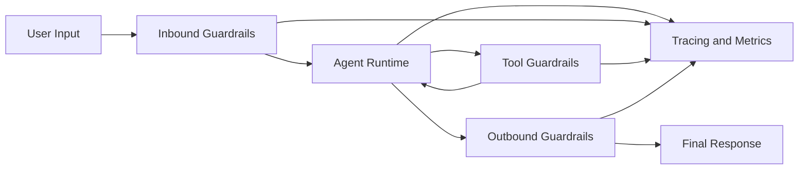

# 39. Guardrails Theory And Concepts

## Table of Contents

| # | Section | What You'll Learn |
|---|---|---|
| 1 | [Why Guardrails Matter](#1-why-guardrails-matter) | Why prompts are not enough for enterprise safety |
| 2 | [Guardrails Architecture](#2-guardrails-architecture) | Inbound and outbound enforcement layers |
| 3 | [Deep Dive: Guardrail Types](#deep-dive-guardrail-types) | Deterministic, model-based, and human-in-the-loop controls |
| 4 | [Deep Dive: Middleware Lifecycle](#deep-dive-middleware-lifecycle) | Where to enforce checks in the agent loop |
| 5 | [Deep Dive: Scope by Requirement (Input vs Output vs Both)](#deep-dive-scope-by-requirement-input-vs-output-vs-both) | How to choose enforcement scope per requirement |
| 6 | [Deep Dive: NLI for Guardrails](#deep-dive-nli-for-guardrails) | How entailment/contradiction decisions enforce policy |
| 7 | [Deep Dive: NLI vs Semantic Similarity](#deep-dive-nli-vs-semantic-similarity) | When to use each and how to combine them safely |
| 8 | [Deep Dive: Classifier Strategy Layer](#deep-dive-classifier-strategy-layer) | Where SOTA classifiers fit and how to operate them safely |
| 9 | [Deep Dive: PII Protection Patterns](#deep-dive-pii-protection-patterns) | Redact, mask, hash, and block strategies |
| 10 | [Deep Dive: Tool Guardrails](#deep-dive-tool-guardrails) | Tool allowlists, parameter checks, and policy gates |
| 11 | [Deep Dive: Guardrails Operations](#deep-dive-guardrails-operations) | Metrics, incident response, and rollout strategy |
| 12 | [Interview Q&A Anchors](#interview-qa-anchors) | Production-grade answer patterns |
| 13 | [References](#references) | Official docs and standards |

---

## Key Definitions

| Term | Quick Recall | Full Definition |
|---|---|---|
| Guardrail | Deterministic safety boundary | Programmatic controls that enforce policy independent of model behavior. |
| Inbound Guardrail | Pre-LLM request filter | Checks user input before the model sees it (prompt injection, PII, policy scope). |
| Outbound Guardrail | Pre-response release check | Validates or sanitizes model output before returning to users. |
| Tool Guardrail | Tool execution policy | Controls whether a tool can be called and with which arguments. |
| Deterministic Guardrail | Rule-based check | Uses regex, schema, allowlists, and static logic for predictable enforcement. |
| Model-Based Guardrail | LLM classifier/gate | Uses a second model to classify safety/quality risk when rules are insufficient. |
| Natural Language Inference (NLI) | Entailment logic check | Determines whether a premise entails, contradicts, or is neutral to a policy hypothesis. |
| Semantic Similarity | Meaning closeness score | Measures how semantically close two texts are, typically via embedding cosine similarity. |
| Classifier Cascade | Multi-stage moderation stack | Routes traffic through cheap-to-expensive classifiers based on uncertainty and risk. |
| Calibration | Confidence reliability alignment | Process of mapping model confidence to true empirical risk using validation data. |
| Human-in-the-Loop (HITL) | Manual approval checkpoint | Requires user or reviewer approval before sensitive tool actions. |
| Fail-Closed | Block on uncertainty | Default deny behavior when guardrail confidence or validations fail. |
| Fail-Open | Allow on uncertainty | Default allow behavior for low-risk paths where availability is prioritized. |
| Policy Drift | Guardrail mismatch over time | Gaps between intended policy and runtime enforcement caused by evolving prompts/tools/models. |

---

## 1. Why Guardrails Matter

Prompt instructions are guidance, not enforcement. In production systems, users, tools, and model outputs can move outside expected boundaries. A robust agent must enforce policy with code.

Typical failures without guardrails:

1. Prompt injection in user input bypasses business rules.
2. Outbound response accidentally exposes sensitive values.
3. Agent calls a risky tool with malformed or unauthorized arguments.
4. Model fabricates policy answers with high confidence.

Guardrails transform safety from best effort into architecture.

---

## 2. Guardrails Architecture

A production setup usually has four layers:

1. Ingress checks: before model/tool planning.
2. Execution checks: before/around tool calls.
3. Egress checks: after model output and before user response.
4. Control-plane checks: observability, alerts, and policy lifecycle.

### Guardrail Placement Principle

- Put cheap deterministic checks first.
- Put expensive model-based checks later and only where needed.
- For risky actions, route through HITL and fail-closed behavior.

---

## Deep Dive: Guardrail Types

### 1. Deterministic Guardrails

Best for:
- PII detection patterns
- Input topic scope
- JSON/schema validation
- Allowed tool names and argument ranges

Advantages:
- Fast
- Cheap
- Explainable
- Repeatable

### 2. Model-Based Guardrails

Best for:
- Semantic safety checks
- Subtle toxicity/abuse classes
- Hallucination likelihood checks

Trade-offs:
- Higher cost/latency
- Potential classifier disagreement
- Needs evaluation/threshold tuning

### 3. Human-in-the-Loop Guardrails

Best for:
- Sending emails/messages
- Financial transactions
- Data export/deletion
- Policy exceptions

Use HITL as a control for irreversible actions.

---

## Deep Dive: Middleware Lifecycle

LangChain guardrails are usually implemented as middleware hooks around agent execution.

Common hook timing:

- before_agent: validate high-level request context.
- before_model: sanitize messages before model call.
- wrap_tool_call: enforce tool-level policy and argument rules.
- after_model: inspect output chunks or message content.
- after_agent: final safety/quality gate before release.

### Production Pattern

1. before_agent: reject injection signatures and unsupported intents.
2. before_model: redact/mask PII so providers never receive raw secrets.
3. wrap_tool_call: deny unauthorized tools/args.
4. after_agent: run final safety policy check and rewrite/block if unsafe.

---

## Deep Dive: Scope by Requirement (Input vs Output vs Both)

Not every requirement needs both sides. Scope should follow risk.

### Requirement-to-Scope Matrix

| Requirement Type | Input Guardrail | Output Guardrail | Why |
|---|---|---|---|
| Prompt injection defense | Required | Optional | Attack enters through user text before planning/tool calls. |
| Sensitive data ingress (user-provided PII/secrets) | Required | Optional | Prevents sending raw secrets to model/provider logs. |
| Sensitive data egress (model leaks PII/secrets) | Optional | Required | Stops accidental disclosure in final answer. |
| Style/tone/brand policy | Optional | Required | Usually concerns generated response quality. |
| Domain/topic restriction | Required | Optional | Block unsupported intent early to reduce cost/risk. |
| Tool safety and side-effect control | Required | Optional | Main risk is execution path before tool call. |
| Regulated environments (finance/healthcare) | Required | Required | Defense-in-depth and auditability on both sides. |

### When to choose Input-only

Use input-only when your main risk is malicious requests, off-domain usage, or raw secret ingestion.

Typical controls:

1. before_agent denylist/allowlist logic.
2. before_model PII redaction/block.
3. Tool preconditions and argument schema checks.

### When to choose Output-only

Use output-only when your main risk is content disclosure, unsafe phrasing, or policy non-compliant final responses.

Typical controls:

1. after_model/after_agent final answer checks.
2. PII masking/redaction on output.
3. LLM-as-judge safety classifier for nuanced policies.

### When to choose Both

Use both in production systems where you need strict compliance or where either side can independently create harm.

Typical controls:

1. Input: injection defense + ingress PII controls.
2. Tool path: allowlist + fail-closed checks.
3. Output: egress PII + safety/quality policy gates.

Design rule: for high-risk requirements, default to both.

---

## Deep Dive: NLI for Guardrails

NLI (Natural Language Inference) evaluates a directional claim:

1. Premise: the text you observed (user input or model output).
2. Hypothesis: a policy statement you want to test.
3. Label: entailment, contradiction, or neutral.

### Why NLI is useful in guardrails

1. It supports policy reasoning beyond keyword matching.
2. It is directional, so you can test specific policy claims.
3. It is auditable: every block can be tied to a hypothesis.

### NLI guardrail pattern

1. Deterministic checks first (regex/schema/allowlists).
2. Run NLI only on borderline or high-impact cases.
3. Use thresholds for each policy hypothesis.
4. Block, rewrite, escalate, or allow based on score and label.

Example hypotheses:

1. "This response includes medical diagnosis advice."
2. "This response requests credential disclosure."
3. "This output contains self-harm encouragement."

---

## Deep Dive: NLI vs Semantic Similarity

Both are semantic techniques, but they answer different questions.

### Comparison Table

| Aspect | NLI | Semantic Similarity |
|---|---|---|
| Core Question | Does premise support/contradict hypothesis? | How close in meaning are two texts? |
| Output Type | entailment / contradiction / neutral + confidence | scalar similarity score |
| Directional | Yes | Usually no (symmetric) |
| Best For | Policy enforcement, claim verification | Retrieval, dedupe, caching, reranking |
| Failure Mode | Model calibration and threshold sensitivity | High score for opposite claims with shared vocabulary |
| Guardrail Role | Primary for nuanced policy decisions | Secondary signal for ambiguity triage |

### Why they are not interchangeable

Two sentences can be semantically close yet policy-opposite.

Example:

1. "You should take this medication daily."
2. "You should not take this medication daily."

Similarity may remain high because vocabulary overlaps. NLI can classify contradiction, which is what guardrails need.

### Production decision flow

1. If deterministic rule matches hard-block, block immediately.
2. Else run NLI against policy hypotheses.
3. If entailment score >= block threshold, block or safe-rewrite.
4. If contradiction score >= contradiction threshold, allow or reduce risk score.
5. If neutral/low confidence, escalate to HITL for critical domains.

### Threshold guidance (starting points)

1. High-risk policy block: entailment >= 0.85
2. Medium-risk review: entailment between 0.60 and 0.85
3. Neutral/low confidence: < 0.60 and route by risk class

Tune thresholds with offline evals before production rollout.

---

## Deep Dive: Classifier Strategy Layer

SOTA classifiers are important, but they are a layer, not the whole guardrail system.

### Where this layer sits

1. Deterministic layer first: regex/schema/allowlists.
2. Classifier layer second: NLI, abuse/toxicity, policy classifiers.
3. Control layer last: HITL, fail-closed workflows, audit and incident response.

### Why SOTA classifiers matter

1. Better semantic recall for subtle unsafe content.
2. Better precision for paraphrased or obfuscated violations.
3. Stronger multilingual and long-tail behavior (model dependent).
4. Better policy coverage where keywords fail.

### Why SOTA alone is not sufficient

1. Benchmark gains may not transfer to your domain.
2. Cost and latency can be too high for all-traffic enforcement.
3. Confidence can be miscalibrated without domain tuning.
4. Adversarial prompting still requires deterministic controls.

### Classifier cascade pattern (production default)

| Tier | Purpose | Typical Model | Action |
|---|---|---|---|
| Tier A | Fast broad screening | lightweight classifier/rule hybrid | block clear violations, pass clear safe |
| Tier B | High-accuracy semantic check | stronger NLI/policy classifier | block/review on threshold |
| Tier C | High-impact uncertainty handling | human reviewer | approve/reject/escalate |

### Confidence-band actions

1. High confidence unsafe: block.
2. Medium confidence unsafe: safe rewrite or HITL.
3. Low confidence: allow with monitoring for low-risk flows.

### Model selection checklist

1. Policy coverage: does it map to your required labels?
2. Calibration quality: does confidence track empirical risk?
3. Latency budget: does it fit p95 and p99 targets?
4. Cost profile: sustainable at production volume?
5. Explainability: can decisions be audited and reproduced?

### Evaluation checklist for classifier layer

1. Per-label precision, recall, and F1.
2. False-positive impact by workflow.
3. Drift by language, channel, and user segment.
4. Adversarial robustness tests.
5. Threshold re-tuning cadence tied to policy updates.

---

## Deep Dive: PII Protection Patterns

PII strategy depends on risk and use case.

| Strategy | Behavior | Use Case |
|---|---|---|
| block | deny request/response | Highly regulated data or zero-leak domains |
| redact | replace full token with placeholder | Logs, prompts, and analytics hygiene |
| mask | partial obfuscation | UX where last digits/domain are useful |
| hash | deterministic pseudonym | Entity linking without plaintext exposure |

### Where to Apply PII Controls

1. apply_to_input: before model sees user content.
2. apply_to_tool_results: when tools return data.
3. apply_to_output: before final response is sent.

If your policy says sensitive values must never leave your boundary, apply inbound controls first.

---

## Deep Dive: Tool Guardrails

Tool calling is where enterprise risk spikes. A good guardrail plan includes:

1. Tool allowlist by user role.
2. Argument schema validation and bounds checks.
3. Context-aware policy checks (tenant, region, approval status).
4. Side-effect classification (read-only vs write/delete/send).
5. HITL for irreversible side effects.

### Example Policy Matrix

| Tool | Risk Class | Guardrail |
|---|---|---|
| search_docs | Low | Allow with input sanitation |
| read_ticket | Medium | Role + tenant validation |
| send_email | High | HITL approval required |
| transfer_funds | Critical | Fail-closed + dual approval |

---

## Deep Dive: Guardrails Operations

Guardrails are not done after coding. They require ongoing operations.

### Metrics to Track

1. Guardrail trigger rate by type.
2. False-positive rate and user impact.
3. Blocked high-risk actions count.
4. Added latency per guardrail layer.
5. Policy version adoption and rollback events.

### Incident Workflow

1. Detect anomaly in traces/alerts.
2. Classify as policy miss, model issue, or implementation bug.
3. Patch deterministic rules first.
4. Add test cases to golden/security datasets.
5. Re-evaluate and rollout with canary.

### Rollout Strategy

1. Shadow mode: log only, no blocking.
2. Soft mode: redact/warn for medium risk.
3. Enforced mode: block/fail-closed for critical policies.

---

## Interview Q&A Anchors

**Q: Why are prompts alone insufficient for enterprise safety?**
> **A:** Prompts influence model behavior but do not enforce policy deterministically. Users can inject adversarial instructions, tools can return sensitive data, and models can still hallucinate. Guardrails add hard enforcement points before and after model execution.

**Q: What is the difference between inbound and outbound guardrails?**
> **A:** Inbound guardrails sanitize and validate requests before model or tool planning. Outbound guardrails inspect final content and block/redact unsafe responses before user delivery. Together they provide two-way protection.

**Q: When should I use deterministic checks vs model-based checks?**
> **A:** Use deterministic checks for high-confidence, low-cost rules like regex PII detection, schema checks, and allowlists. Use model-based checks for nuanced semantic policies where rules are brittle. Keep model checks targeted because they add latency and cost.

**Q: What is NLI and why use it in guardrails?**
> **A:** NLI tests whether observed text entails, contradicts, or is neutral to a policy hypothesis. It is useful for policy enforcement where keyword filters are too brittle, because it reasons over meaning directionally. In production, use it after deterministic checks and with calibrated thresholds.

**Q: Is NLI the same as semantic similarity?**
> **A:** No. Similarity measures closeness of meaning, while NLI evaluates logical relation between a premise and a claim. Similarity is excellent for retrieval and caching; NLI is stronger for enforcement decisions like allow/block/escalate.

**Q: Are SOTA classifiers essential in guardrails?**
> **A:** They are important for nuanced policy detection, especially where deterministic rules are brittle. But they should be used as one layer in a cascade, not as the only control. Production systems still need deterministic checks, calibrated thresholds, and HITL for high-impact uncertainty.

**Q: How do you guard tool calls in production agents?**
> **A:** Apply tool allowlists by role, validate argument schema and bounds, and gate side-effecting tools behind HITL approvals. For critical actions, fail closed by default and require explicit policy evidence.

**Q: What does fail-closed mean in AI guardrails?**
> **A:** Fail-closed means deny execution when policy confidence is insufficient or validation fails. It minimizes security exposure at the cost of availability. This is preferred for high-risk domains like finance and healthcare.

**Q: What are the most important operational metrics for guardrails?**
> **A:** Track trigger rates, false positives, blocked risky actions, latency overhead, and policy version drift. These metrics reveal whether controls are effective and whether they are harming user experience.

---

## References

- LangChain Python guardrails: https://docs.langchain.com/oss/python/langchain/guardrails
- LangChain Python built-in middleware: https://docs.langchain.com/oss/python/langchain/middleware/built-in
- LangChain middleware overview: https://docs.langchain.com/oss/python/langchain/middleware
- LangSmith tracing guide: https://docs.langchain.com/langsmith/trace-with-langchain
- Hugging Face NLI task reference: https://huggingface.co/tasks/text-classification
- OpenAI moderation guide: https://platform.openai.com/docs/guides/moderation
- OWASP Top 10 for LLM Applications: https://owasp.org/www-project-top-10-for-large-language-model-applications/
- NIST AI Risk Management Framework: https://www.nist.gov/itl/ai-risk-management-framework
